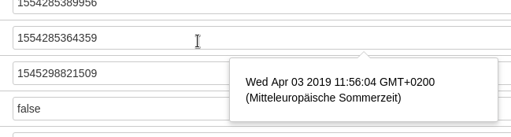

# Timestamp-to-Date for Crowd 

This app for Atlassian Crowd transforms timestamp values in input fields (e.g. user attributes) to a human-readable date displayed on hover in a tooltip.

## Screenhot

